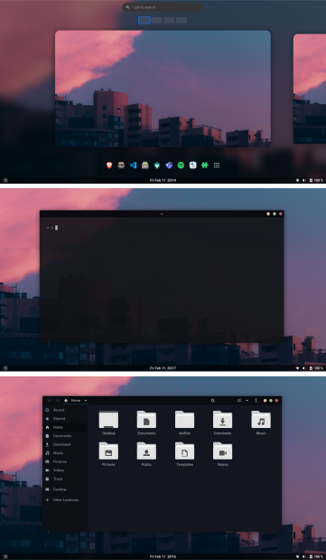

    

This is my personal collection of configuration files. 

### Details

| Need                 | App                                                                                                                 |
| :------------------- | :------------------------------------------------------------------------------------------------------------------ |
| Desktop Environment  | [Gnome](https://www.gnome.org/)                                                                                     |
| Shell                | [Zsh](https://www.zsh.org/)                                                                                         |
| Terminal Emulator    | [Alacritty](https://github.com/alacritty/alacritty)                                                                 |
| Terminal Colorscheme | Voila (Custom)                                                                                                      |
| GTK Theme            | [Catppuccin](https://github.com/catppuccin/gtk)                                                                     |
| Icon Theme           | [Papirus](https://github.com/PapirusDevelopmentTeam/papirus-icon-theme)                                             |
| Cursor Theme         | [Whitesur](https://github.com/vinceliuice/WhiteSur-cursors)                                                         |
| PDF Viewer           | [Zathura](https://pwmt.org/projects/zathura/)                                                                       |
| Fonts                | [Roboto](https://fonts.google.com/specimen/Roboto) / [Cascadia Code PL](https://github.com/microsoft/cascadia-code) |

### Previews

    

