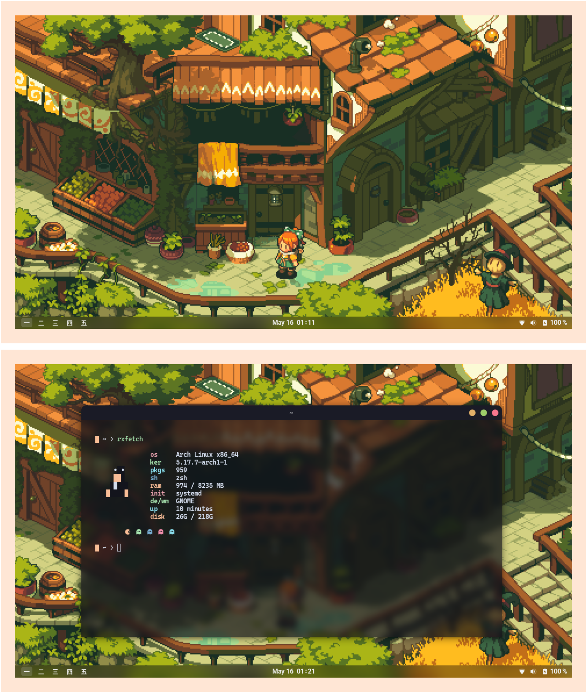

    

This is my personal collection of configuration files for the gnome desktop environment. 

### Details

| Need                 | App                                                                                                                 |
| :------------------- | :------------------------------------------------------------------------------------------------------------------ |
| Desktop Environment  | [Gnome](https://www.gnome.org/)                                                                                     |
| Shell                | [Zsh](https://www.zsh.org/)                                                                                         |
| Terminal Emulator    | [Kitty](https://github.com/kovidgoyal/kitty)                                                                        |
| Terminal Colorscheme | [Voila (Custom)](https://github.com/Harshit-T/voila/blob/main/.config/kitty/kitty.conf)                             |
| GTK Theme            | [Tokyo Night](https://github.com/Fausto-Korpsvart/Tokyo-Night-GTK-Theme)                                            |
| Icon Theme           | [Papirus](https://github.com/PapirusDevelopmentTeam/papirus-icon-theme)                                             |
| Cursor Theme         | [Whitesur](https://github.com/vinceliuice/WhiteSur-cursors)                                                         |
| PDF Viewer           | [Zathura](https://pwmt.org/projects/zathura/)                                                                       |
| Fonts                | [Roboto](https://fonts.google.com/specimen/Roboto) / [Cascadia Code PL](https://github.com/microsoft/cascadia-code) |

#### Recommended Gnome Extensions:

- [Just Perfection](https://extensions.gnome.org/extension/3843/just-perfection/)
- [Bluetooth Quick Connect](https://extensions.gnome.org/extension/1401/bluetooth-quick-connect/)
- [Sound Input And Output Device Chooser](https://extensions.gnome.org/extension/906/sound-output-device-chooser/)
- [Impatience](https://extensions.gnome.org/extension/277/impatience/)
- [Blur My Shell](https://extensions.gnome.org/extension/3193/blur-my-shell/)
- [Dash To Panel](https://extensions.gnome.org/extension/1160/dash-to-panel/)
- [Workspaces Bar](https://extensions.gnome.org/extension/3851/workspaces-bar/)

### Previews

    

