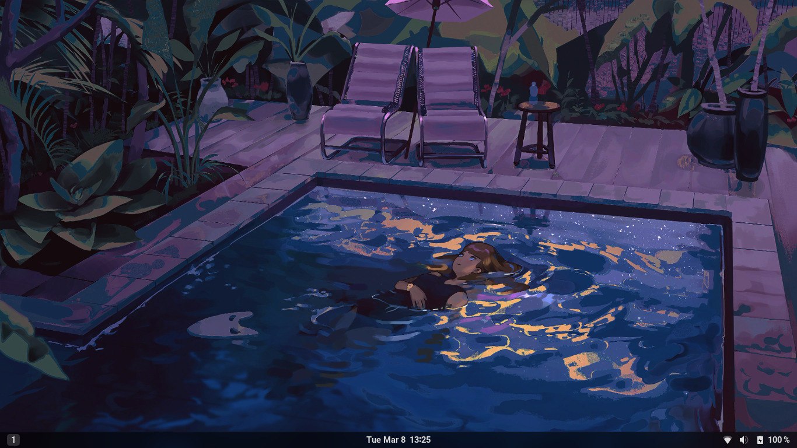
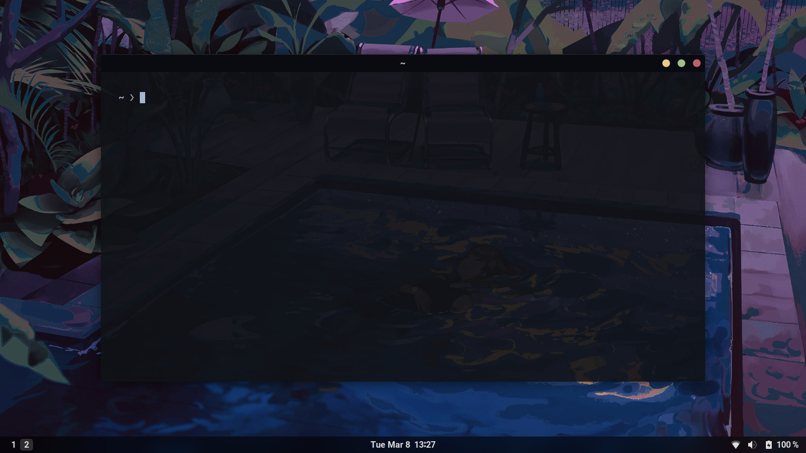
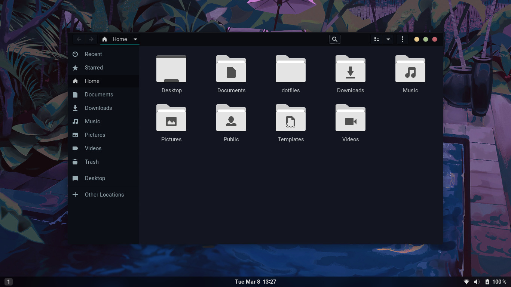
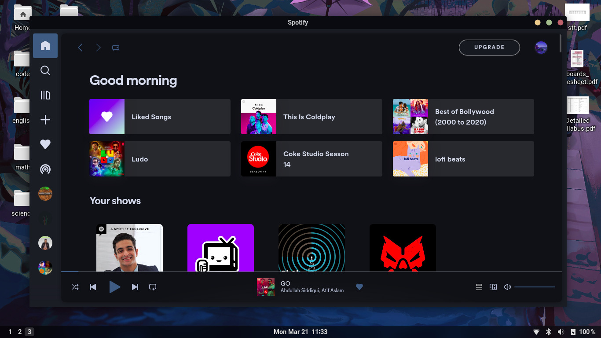
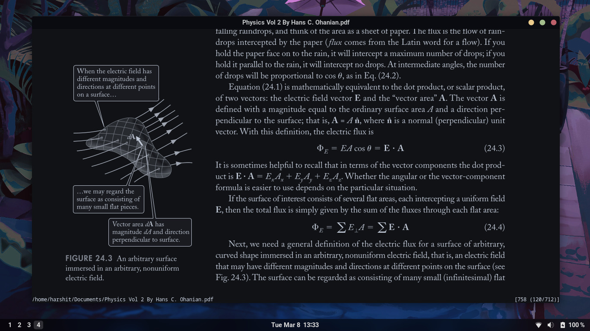

    

This is my personal collection of configuration files.  
Here are some details about my setup:

- **DE** : [Gnome](https://www.gnome.org/)
- **Shell** : [Bash](https://www.gnu.org/software/bash/)
- **Terminal** : [Kitty](https://sw.kovidgoyal.net/kitty/)
- **Application Launcher** : [Rofi](https://github.com/davatorium/rofi)
- **File Manager** : [Nautilus](https://en.wikipedia.org/wiki/GNOME_Files)
- **Music Player** : [Spotify](https://www.spotify.com/us/download/linux)
- **PDF Viewer** : [Zathura](https://pwmt.org/projects/zathura/)
- **Colorscheme** : [Mountain Peek](https://github.com/nautilor/mountain-peek)
- **Icons** : [Papirus](https://github.com/PapirusDevelopmentTeam/papirus-icon-theme)
- **GTK** : [Juno Ocean](https://github.com/EliverLara/Juno)
- **Fonts**
    + System-wide : [Roboto](https://fonts.google.com/specimen/Roboto)
    + Terminal : [Cascadia Code PL](https://github.com/microsoft/cascadia-code)

Here are some previews:

