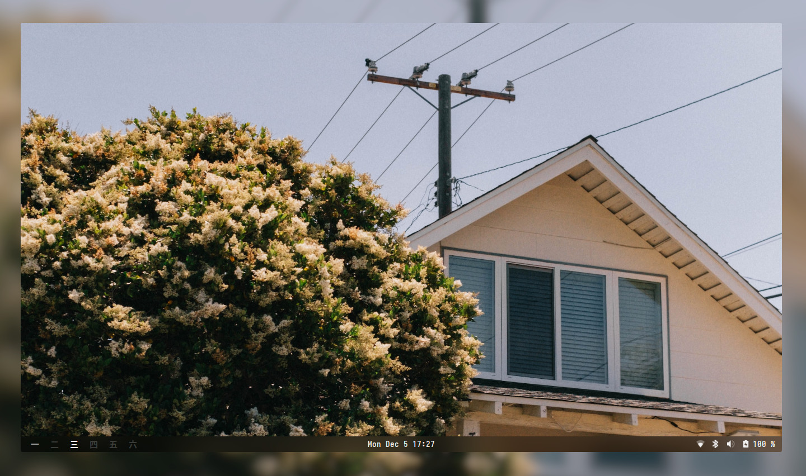

    

This is my personal collection of configuration files for the gnome desktop environment. 

### Details

| Need                 | App
| :------------------- | :--
| Desktop Environment  | [Gnome](https://www.gnome.org/)
| Shell                | [Zsh](https://www.zsh.org/)
| Terminal Emulator    | [Kitty](https://github.com/kovidgoyal/kitty)
| Terminal Colorscheme | [Voila (Custom)](https://github.com/Harshit-T/voila/blob/main/.config/kitty/kitty.conf)
| GTK Theme            | [Catpuccin Mocha BL](https://github.com/damnitharshit/voila/tree/main/.themes/Catppuccin-Mocha-BL)
| Icon Theme           | [Papirus](https://github.com/PapirusDevelopmentTeam/papirus-icon-theme)
| Cursor Theme         | [Whitesur](https://github.com/vinceliuice/WhiteSur-cursors)
| PDF Viewer           | [Zathura](https://pwmt.org/projects/zathura/)
| Fonts                | [Iosevka](https://github.com/be5invis/Iosevka) / [Cascadia Code PL](https://github.com/microsoft/cascadia-code)

#### Recommended Gnome Extensions:

- [Impatience](https://extensions.gnome.org/extension/277/impatience/)
- [Blur My Shell](https://extensions.gnome.org/extension/3193/blur-my-shell/)
- [Dash To Panel](https://extensions.gnome.org/extension/1160/dash-to-panel/)
- [Workspaces Bar](https://extensions.gnome.org/extension/3851/workspaces-bar/)
- [Rounded Window Corners](https://github.com/yilozt/rounded-window-corners)

### Previews

    

